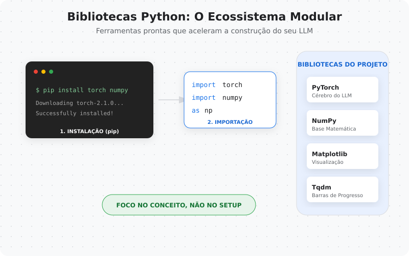

# Passo Zero: antes de criar um LLM, precisamos alinhar o terreno

Antes de falar sobre tokens, atenção ou modelos, precisamos resolver um problema real:
**como aprender LLMs sem depender de hardware caro?**

A resposta prática para essa série é: **Google Colab**.

---

## ☁️ O que é o Google Colab?

O Google Colab é um ambiente de notebooks (estilo Jupyter) rodando na nuvem.
Você escreve Python em células, executa e vê os resultados em sequência.

O diferencial aqui é o “zero fricção”:
- você não precisa instalar nada no seu computador
- consegue usar CPU/GPU com poucos cliques
- o notebook vira um laboratório replicável

> Ideia-chave: Colab tira o peso da infraestrutura e coloca o foco no entendimento.


---

## ✅ Por que vamos usar o Colab nesta série?

Porque ele:
- democratiza o acesso (não precisa de GPU local)
- torna o estudo reproduzível (mesma base para todo mundo)
- facilita experimentação rápida (testar, errar, ajustar, entender)
- funciona muito bem para **modelos pequenos e didáticos**

---

## ⚠️ Limitações do Colab (honestidade importa)

O Colab não é um datacenter gratuito infinito.

Algumas limitações:
- a sessão pode expirar
- a GPU nem sempre está disponível (depende do plano e do momento)
- não é ambiente de produção

Mas… para aprender LLMs do zero, ele é perfeito.

---

## 🔥 O que é PyTorch?

PyTorch é uma biblioteca de deep learning usada para construir e treinar redes neurais.

Ele dá as peças principais:
- **tensores** (números com “forma”: vetores, matrizes, etc.)
- operações rápidas (CPU/GPU)
- cálculo automático de gradientes (base do treinamento)

Se LLM é “texto virando matemática”, PyTorch é a oficina onde a matemática acontece.


---

## 📦 O que são bibliotecas em Python?

Bibliotecas são “caixas de ferramentas”.
Em vez de escrever tudo do zero, você importa ferramentas prontas e confiáveis.

Exemplo:

```python
import torch
```

Essa linha carrega um ecossistema inteiro de funções e classes.
Para instalar bibliotecas, usamos o pip:

```bash
pip install nome-da-biblioteca
```




### 🧪 Código: seu primeiro contato com PyTorch

A ideia aqui é simples:
 - criar um tensor
 - fazer uma operação
 - enxergar a saída


```python
import torch

x = torch.tensor([1.0, 2.0, 3.0])
y = x * 2

print("x =", x)
print("y =", y)
```

Isso pode parecer bobo, mas é um marco:
daqui pra frente, texto vira número, e número vira tensor.

### 🧠 O que isso muda na forma de aprender LLMs?

Quando você entende o básico:
- “inteligência” vira processo
- “mágica” vira engenharia
- “instrução” vira interface, não fundamento

E aí você começa a usar LLMs melhor:
- com mais consciência de limitações
- com melhores estratégias
- com mais capacidade de depurar problemas

Nota: Colab clona o repositório e roda tudo em um ambiente temporário.  
Se você editar arquivos dentro do Colab, lembre de baixar ou commitar antes da sessão expirar.

### 🚀 Execute agora

- **Notebook:** `00-passo-zero/notebook.ipynb`
- **Abrir direto no Colab:** (veja `links.md`)


---

## 🧾 Glossário Rápido — Conceitos Fundamentais

### 🔹 Notebook
Um notebook é um documento interativo que combina texto explicativo, blocos de código executáveis e seus respectivos resultados (tabelas, gráficos, texto).

Nesta série, o notebook funciona como o **laboratório prático**, onde os conceitos deixam de ser abstratos e passam a ser experimentados.

---

### 🔹 Google Colab
O Google Colab é um ambiente de notebooks que roda **na nuvem**, acessado diretamente pelo navegador.

Ele permite executar código Python sem instalação local, usar CPU ou GPU sob demanda e compartilhar experimentos com facilidade.  
Aqui, ele remove barreiras técnicas para focar no **entendimento dos fundamentos**.

---

### 🔹 Python
Python é a linguagem usada em toda a série.

Ela é amplamente adotada em ciência de dados e inteligência artificial por ser simples de ler, expressiva e suportada por um vasto ecossistema de bibliotecas.

---

### 🔹 Biblioteca
Uma biblioteca é um conjunto de código pronto que resolve problemas comuns.

Em vez de escrever tudo do zero, você:
1. instala a biblioteca (`pip install`)
2. importa no código (`import`)
3. reutiliza funcionalidades testadas e otimizadas

Exemplos comuns são NumPy, PyTorch e Matplotlib.

---

### 🔹 PyTorch
PyTorch é uma biblioteca de **deep learning** usada para construir e treinar redes neurais.

Ela fornece estruturas para representar dados numéricos (tensores), operações matemáticas eficientes e cálculo automático de gradientes — a base do treinamento de modelos modernos.

---

### 🔹 Tensor
Um tensor é uma **estrutura de dados numérica**.

De forma simples:
- um número isolado é um tensor de 0 dimensões
- um vetor é um tensor de 1 dimensão
- uma matriz é um tensor de 2 dimensões
- estruturas maiores também são tensores

Em LLMs, todo texto precisa ser convertido em tensores antes de qualquer processamento.

---

### 🔹 Dimensão (ou *shape*)
A dimensão (*shape*) descreve a forma de um tensor, ou seja, como seus valores estão organizados.

Exemplos:
- `[3]` → vetor com 3 valores
- `[2, 3]` → matriz com 2 linhas e 3 colunas

Entender *shape* é essencial para compreender como os dados fluem dentro de um modelo.

---

### 🔹 CPU e GPU
- **CPU** é o processador de uso geral do computador.
- **GPU** é especializada em cálculos paralelos.

Modelos de IA utilizam GPU porque envolvem muitas operações numéricas que podem ser executadas em paralelo, tornando o processamento mais eficiente.

---

### 🔹 Reprodutibilidade
Reprodutibilidade é a capacidade de obter o mesmo resultado ao executar o mesmo código novamente.

Em aprendizado de máquina, isso depende do controle de seeds aleatórias, versões de bibliotecas e do ambiente de execução.

---

### 🔹 Seed (semente aleatória)
Uma *seed* é um valor fixo usado para controlar processos aleatórios.

Ao utilizar a mesma seed:
- resultados aleatórios se repetem
- experimentos se tornam comparáveis
- o aprendizado fica mais previsível

---

### 🔹 Ambiente de Execução
O ambiente de execução inclui tudo o que influencia o código:
- versão do Python
- bibliotecas instaladas
- hardware disponível (CPU/GPU)
- sistema operacional

O Google Colab fornece um ambiente relativamente padronizado, reduzindo diferenças entre usuários.

---
