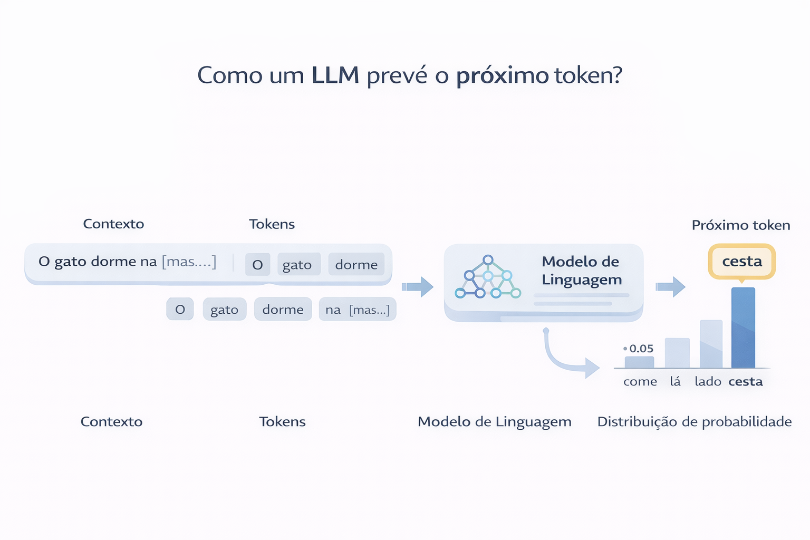
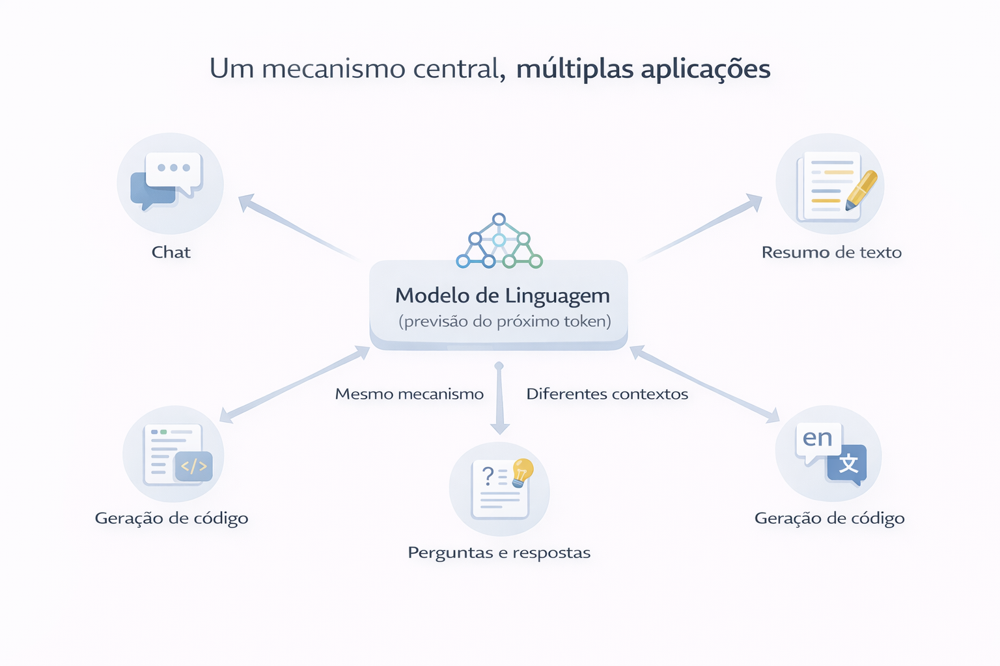
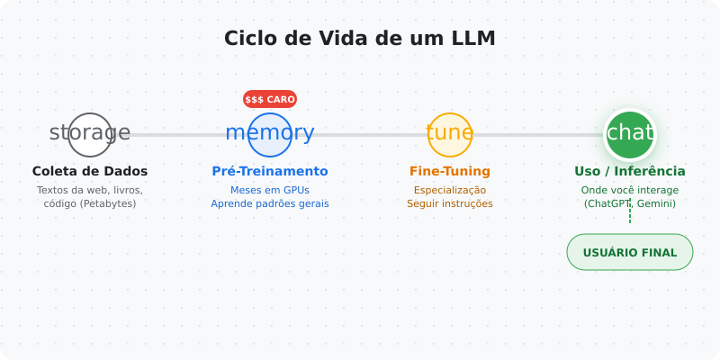
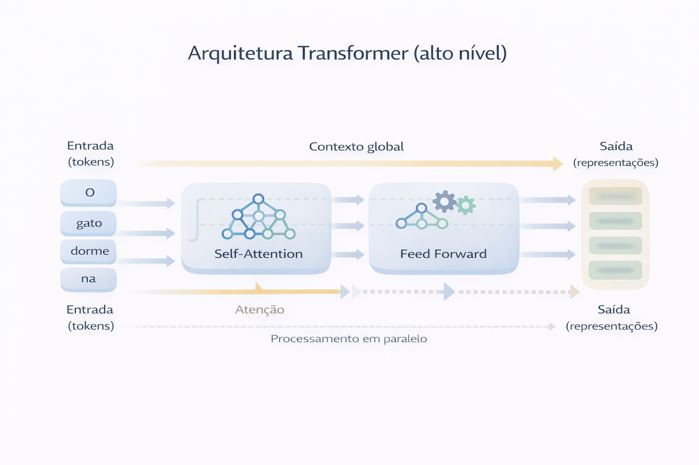
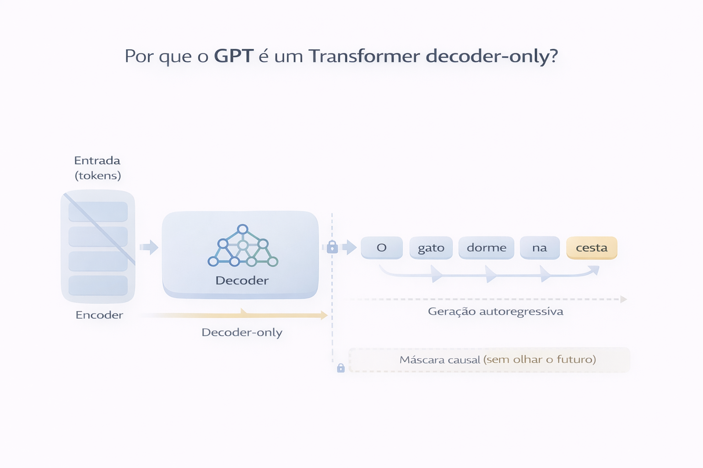

# Capítulo 01 — O que é um LLM (de verdade)

Antes de falar sobre tokenização, atenção ou treinamento, precisamos alinhar uma coisa fundamental:

**o que exatamente é um Large Language Model?**

Não no sentido de marketing.
Não como “uma IA que entende linguagem”.
Mas no sentido técnico e conceitual que realmente explica por que esses modelos funcionam — e também por que eles falham.

Este capítulo constrói o **modelo mental** que sustenta todo o resto da série.

---

## O que é um LLM?

Um Large Language Model (LLM) é, essencialmente, um **modelo estatístico treinado para prever o próximo token** em uma sequência de texto, dado um contexto anterior.

Isso pode soar simples demais — e é justamente aí que mora a surpresa.

Um LLM não começa entendendo frases, ideias ou intenções.
Ele começa aprendendo padrões de probabilidade.

A pergunta fundamental que o modelo aprende a responder é sempre a mesma:

> “Dado tudo que veio antes, qual é o próximo token mais provável?”

### Visualizando a ideia central

O funcionamento básico de um LLM pode ser resumido como um fluxo:
texto → tokens → modelo → probabilidades → próximo token.

---

### Uma analogia do mundo real

Pense em um aplicativo de previsão de texto no celular.

Quando você digita:

> “Bom dia, tudo…”

O teclado sugere:
- “bem”
- “certo”
- “tranquilo”

Ele não *entende* a conversa.
Ele apenas aprendeu, a partir de muitos exemplos, quais palavras costumam vir depois de “Bom dia, tudo”.

Um LLM faz exatamente isso — **só que em uma escala gigantesca**:
- bilhões de exemplos
- bilhões de parâmetros
- contextos muito mais longos

---

## Por que prever o próximo token funciona tão bem?

Linguagem humana não é aleatória.
Ela tem:
- estrutura
- padrões
- regularidades
- dependência de contexto

Quando escrevemos ou falamos, estamos constantemente restringindo o espaço de possibilidades do que vem a seguir.

Depois de ler:

> “O gato subiu no…”

Poucas palavras fazem sentido:
- telhado
- sofá
- muro

Um LLM aprende essas restrições observando **grandes volumes de texto** e ajustando suas probabilidades internas.

Com contexto suficiente, prever o próximo token começa a parecer:
- responder perguntas
- resumir textos
- escrever código
- manter uma conversa

Mas tudo isso ainda é a **mesma operação fundamental**.

---

## Aplicações de LLMs: um mecanismo, muitos usos

Chatbots, resumo de texto, geração de código, tradução, análise de documentos…

À primeira vista, parecem tarefas completamente diferentes.

Mas todas elas podem ser formuladas como variações da mesma pergunta:

> “Dado este contexto, qual é a próxima sequência de tokens mais provável?”

Esse é o motivo pelo qual **um único modelo** pode dar origem a tantas aplicações distintas.

- Responder uma pergunta → continuar o texto com uma resposta
- Traduzir → continuar o texto em outro idioma
- Gerar código → continuar o texto seguindo padrões de código
- Resumir → continuar o texto de forma mais curta

Isso muda a forma como pensamos em LLMs:
não como ferramentas isoladas, mas como **modelos gerais de linguagem**.

---

## Estágios de construção e uso de um LLM

Outro ponto fundamental é separar **como um LLM é criado** de **como ele é usado**.

De forma simplificada, o ciclo envolve quatro estágios principais:

1. **Coleta de dados**  
   Grandes volumes de texto: livros, artigos, código, páginas web.

2. **Pré-treinamento**  
   O modelo aprende padrões gerais da linguagem resolvendo a tarefa de prever o próximo token.

3. **Ajustes (fine-tuning e alinhamento)**  
   O comportamento do modelo é adaptado para usos específicos.

4. **Uso em aplicações**  
   Via APIs, produtos e sistemas finais.

Visualmente, isso deixa claro que quem usa um LLM interage apenas com a **última etapa**.

---

## Introdução à arquitetura Transformer

Modelos antigos de linguagem processavam texto de forma estritamente sequencial.
Isso criava dois problemas sérios:
- dificuldade em capturar dependências longas
- baixa eficiência em escala

A arquitetura **Transformer** surge para resolver isso.

A ideia central é simples, mas poderosa:
> em vez de ler o texto palavra por palavra, o modelo analisa **todas as posições em paralelo**, usando um mecanismo chamado **atenção**.

Isso permite que o modelo:
- relacione palavras distantes
- capture contexto global
- escale melhor com mais dados e parâmetros

Neste capítulo, não entramos nos detalhes matemáticos da atenção.
O objetivo aqui é entender **por que essa arquitetura mudou o jogo**.

---

## Um olhar mais próximo da arquitetura GPT

GPT significa *Generative Pre-trained Transformer*.

Na prática:
- ele é um Transformer
- foi pré-treinado em grandes volumes de texto
- é especializado em **gerar texto**

Tecnicamente, o GPT utiliza apenas a parte **decoder** do Transformer.
Por isso dizemos que ele é um modelo **decoder-only**.

Isso significa que:
- ele gera texto de forma autoregressiva
- cada novo token depende apenas dos tokens anteriores
- o “futuro” é sempre invisível para o modelo

Essa decisão arquitetural é fundamental para entender como o GPT escreve texto passo a passo.

---

## Tokens, modelos fundacionais, encoder e decoder

Antes de avançar, precisamos alinhar alguns conceitos que aparecerão constantemente:

- **Token**  
  A menor unidade de texto processada pelo modelo.  
  Não é necessariamente uma palavra inteira.

- **Modelo fundacional**  
  Um modelo treinado em larga escala, capaz de ser reutilizado e adaptado para diversas tarefas.

- **Encoder**  
  Componente que transforma uma entrada em uma representação interna rica.

- **Decoder**  
  Componente responsável por gerar saídas, token por token, a partir de um contexto.

Modelos como o GPT utilizam apenas o decoder.
Outras arquiteturas combinam encoder e decoder, dependendo da tarefa.

---

## 🧪 Um primeiro experimento mental

Antes de escrever qualquer Transformer, vale refletir:

Se um modelo simples consegue:
- contar frequências
- calcular probabilidades condicionais
- gerar o próximo token mais provável

…então, com dados suficientes, uma arquitetura adequada e escala,
comportamentos cada vez mais complexos podem emergir.

É exatamente isso que vamos explorar nos próximos capítulos.

---

## O que isso muda na forma de usar LLMs?

Quando você entende que um LLM:
- não “entende” linguagem como humanos
- não tem intenção ou consciência
- modela probabilidade sobre texto

Você passa a:
- escrever prompts mais claros
- compreender limitações e falhas
- evitar antropomorfização
- usar o modelo com mais consciência técnica

---

## ▶️ Rode você mesmo

Este capítulo inclui um notebook prático que demonstra, de forma simples,
como a ideia de previsão do próximo token já produz comportamentos interessantes.

- Notebook: `01-o-que-e-um-llm/notebook.ipynb`
- Link direto para o Google Colab:
  veja `links.md`

---

## 🧾 Glossário Rápido — Capítulo 01

### 🔹 Large Language Model (LLM)
Modelo estatístico treinado para prever o próximo token em grandes volumes de texto, usando contexto.

### 🔹 Token
Unidade básica de processamento de texto em um modelo de linguagem.

### 🔹 Modelo fundacional
Modelo treinado em larga escala, capaz de ser adaptado para diversas tarefas.

### 🔹 Transformer
Arquitetura baseada em atenção que permite processar sequências em paralelo.

### 🔹 Encoder
Componente que transforma uma entrada em uma representação interna.

### 🔹 Decoder
Componente responsável por gerar texto token por token.

---

> Este capítulo é o mapa conceitual.  
> Os próximos capítulos transformam cada ideia aqui em código.
