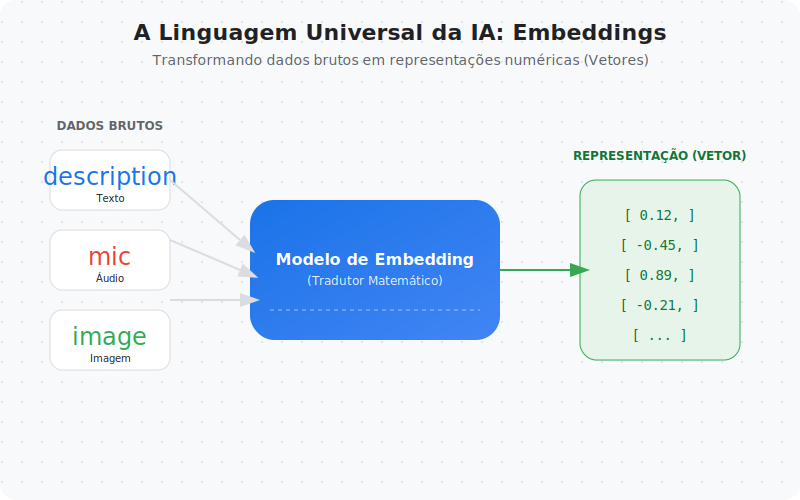
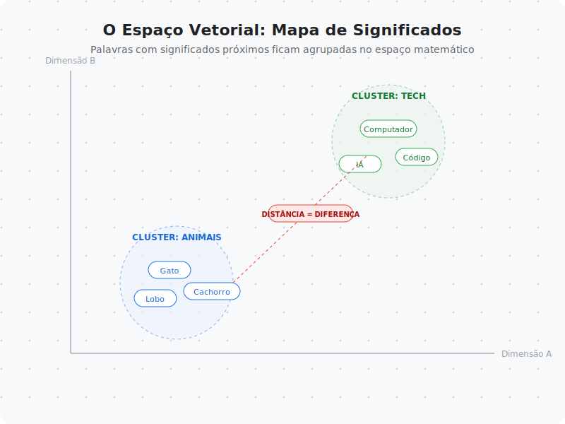
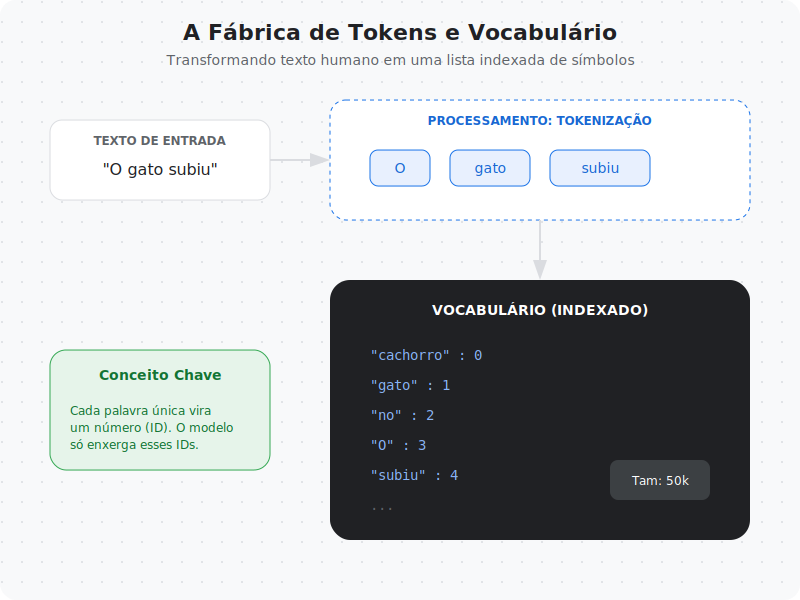
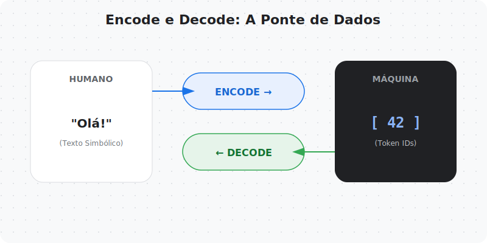
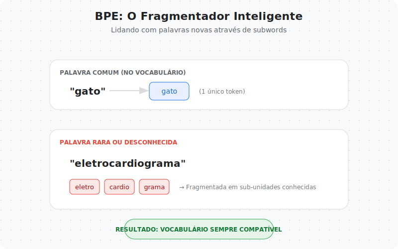
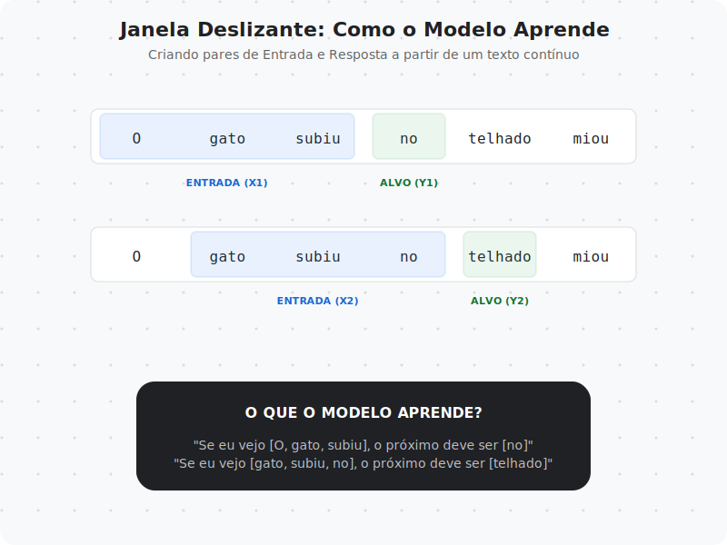

# Capítulo 02 — Texto vira número

No capítulo anterior, entendemos **o que é um LLM**:
um modelo que aprende a prever o próximo token a partir de contexto.

Agora surge uma pergunta ainda mais fundamental:

**como texto — algo simbólico — vira algo que um modelo matemático consegue processar?**

Este capítulo responde exatamente isso.

Aqui entramos no mundo onde:
- palavras viram números
- números viram vetores
- vetores viram contexto
- e contexto vira aprendizado

---

## Por que texto não pode ser usado diretamente?

Modelos de aprendizado profundo não processam símbolos.
Eles processam **números**.

Texto, áudio, imagens e vídeos são formas de dados **brutos**.
Para que um modelo consiga operar sobre eles, tudo precisa ser convertido para
uma **representação numérica densa**.

Isso vale para qualquer modalidade:
- texto
- áudio
- imagem
- vídeo

Todos seguem o mesmo princípio:  
**dados brutos → vetores numéricos**

Esse processo de conversão é chamado de **embedding**.

---

## Embeddings: representando significado como números

Um embedding é um vetor numérico que representa uma entidade — uma palavra,
uma frase, um som ou uma imagem — em um espaço contínuo.

A ideia central é simples:
> coisas semanticamente parecidas ficam **próximas** nesse espaço.

Embeddings não carregam “significado” no sentido humano.
Eles carregam **relações aprendidas a partir dos dados**.

Para visualizar isso, imagine um espaço bidimensional:

Palavras relacionadas a pássaros aparecem próximas.
Cidades aparecem agrupadas.
Adjetivos relacionados formam seus próprios clusters.

Esse tipo de estrutura **emerge do treinamento**.
Não é programado manualmente.

---

## Tokenização: quebrando texto em unidades processáveis

Antes de gerar embeddings, precisamos resolver um problema mais básico:

**como quebrar texto em partes menores que o modelo consiga manipular?**

Esse processo se chama **tokenização**.

Um ponto crucial:
> **tokens não são palavras.**

Dependendo do tokenizer, um token pode ser:
- uma palavra inteira
- parte de uma palavra
- um caractere
- um símbolo especial

O primeiro passo da tokenização é:
1. percorrer todo o texto de treinamento
2. identificar tokens únicos
3. construir um vocabulário

Cada token único recebe um **ID numérico**.
A partir daqui, o texto deixa de ser texto.

---

## Encode e Decode: texto ↔ números

Com um vocabulário em mãos, surgem duas operações fundamentais:

- **encode**: texto → token IDs  
- **decode**: token IDs → texto

Essas duas funções formam a interface básica entre humanos e modelos.

Esse processo é quase sempre **reversível**,
desde que os tokens estejam presentes no vocabulário.

Mas isso nos leva a um problema clássico.

---

## Palavras desconhecidas e o problema do vocabulário

E se o texto contiver uma palavra que **nunca apareceu no treino**?

Esse é o problema conhecido como **OOV (out-of-vocabulary)**.

Uma solução ingênua seria usar um token especial como `<unk>`,
mas isso destrói muita informação.

A solução moderna é usar **subwords**.

---

## Byte Pair Encoding (BPE): quebrando palavras em partes

O BPE resolve o problema quebrando palavras desconhecidas em:
- partes menores
- ou até caracteres individuais

Isso permite que o modelo processe **qualquer palavra**, mesmo que nunca a tenha visto antes.

Com BPE:
- o vocabulário fica controlável
- palavras novas ainda carregam estrutura
- o modelo generaliza melhor

Esse é um dos motivos pelos quais LLMs modernos conseguem lidar com
nomes próprios, termos técnicos e neologismos.

---

## Janela deslizante: como o modelo aprende de fato

Agora entramos em um dos conceitos mais importantes de todo o livro.

LLMs **não aprendem frases inteiras**.
Eles aprendem a partir de **pares deslocados de entrada e alvo**.

A técnica usada para isso é a **janela deslizante**.

O processo é:
- a entrada contém um bloco de tokens
- o alvo é o próximo token
- o modelo **não pode ver o futuro**

Durante o treinamento, aplicamos uma **máscara causal**:
o modelo só enxerga o que veio antes.

Essa mecânica é o coração do treinamento autoregressivo.

---

## O pipeline completo de entrada de um GPT-like

Agora podemos juntar todas as peças.

O caminho completo é:

1. Texto bruto  
2. Tokenização  
3. Token IDs  
4. Token embeddings  
5. Embeddings posicionais  
6. Entrada no modelo GPT-like

Cada etapa resolve um problema específico:
- símbolos → números
- números → vetores
- vetores → sequência com posição
- sequência → contexto

Nada aqui é opcional.
Esse pipeline é a base de qualquer modelo GPT moderno.

---

## Conectando com o que vem a seguir

Depois deste capítulo, é possivel entender algo fundamental:

> um LLM não “lê texto”  
> ele opera sobre **vetores em sequência**, organizados no tempo

No próximo capítulo, vamos finalmente abrir a caixa preta da **atenção**:
o mecanismo que permite ao modelo decidir **o que é importante em cada posição**.

Mas agora, pela primeira vez, sabemos **o que exatamente entra no modelo**.

---

## 🧾 Glossário Rápido — Capítulo 02

**Embedding**  
Representação vetorial densa de uma entidade simbólica.

**Tokenização**  
Processo de quebrar texto em unidades menores chamadas tokens.

**Token ID**  
Identificador numérico único associado a um token no vocabulário.

**Vocabulário**  
Conjunto de todos os tokens conhecidos pelo modelo.

**BPE (Byte Pair Encoding)**  
Algoritmo de tokenização baseado em subwords.

**Janela deslizante**  
Técnica para gerar pares input–target deslocados no tempo.

**Máscara causal**  
Mecanismo que impede o modelo de acessar tokens futuros durante o treino.

---

> Este capítulo é a fundação matemática da linguagem.  
> No próximo, veremos como a atenção transforma esses vetores em contexto.

---

### 🚀 Execute agora

- **Notebook:** `02-texto-vira-numero/notebook.ipynb`
- **Abrir direto no Colab:** (veja `links.md`)
