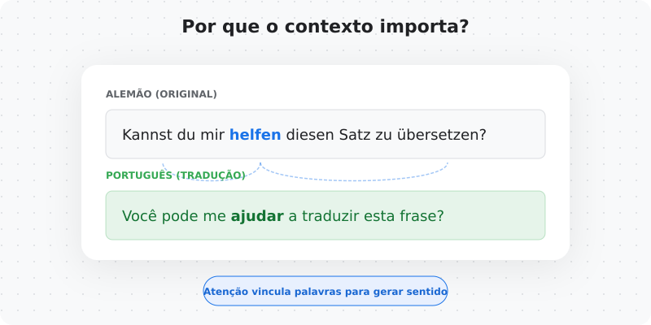
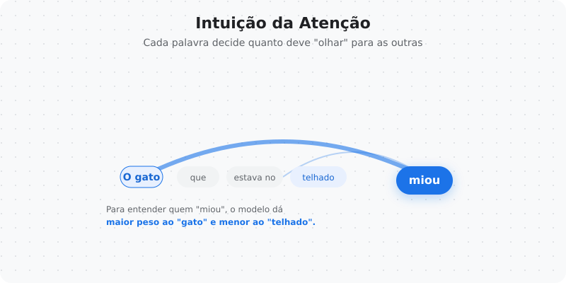
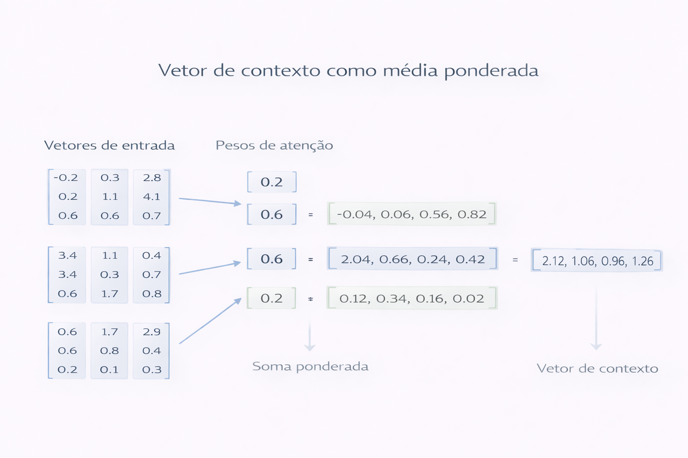
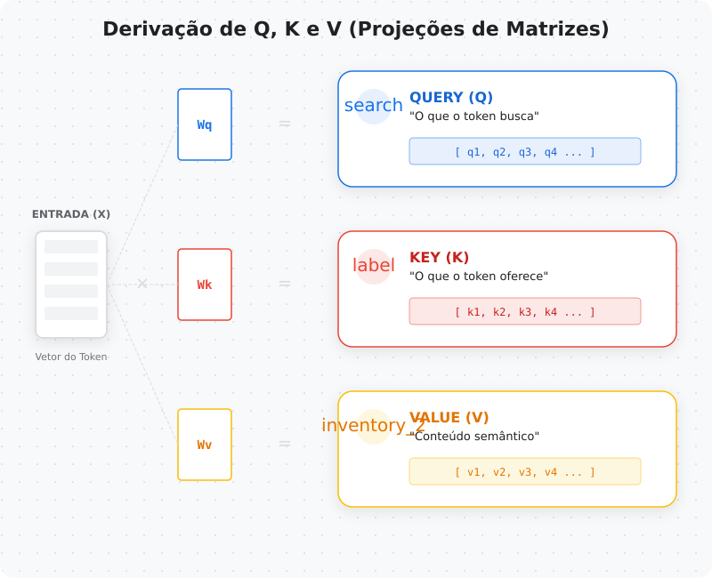
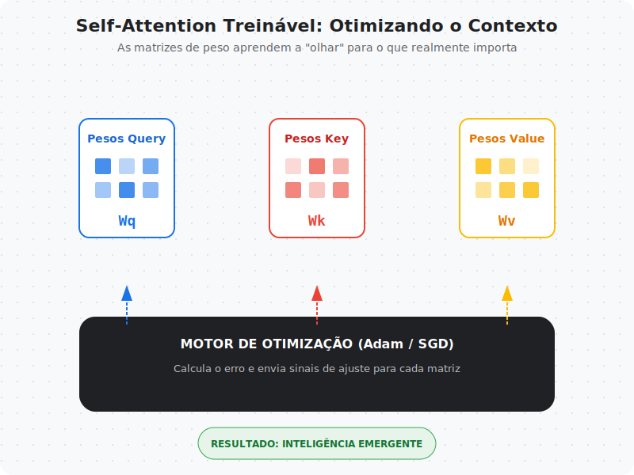
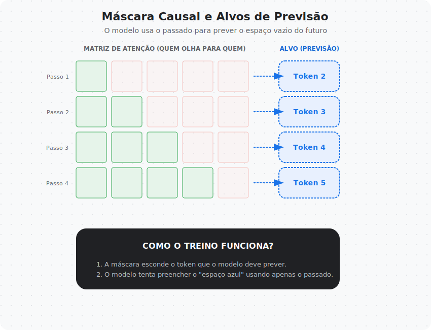
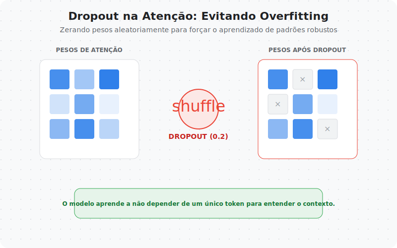
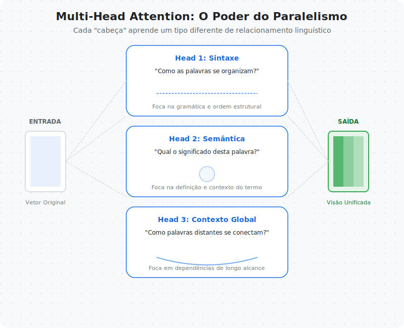
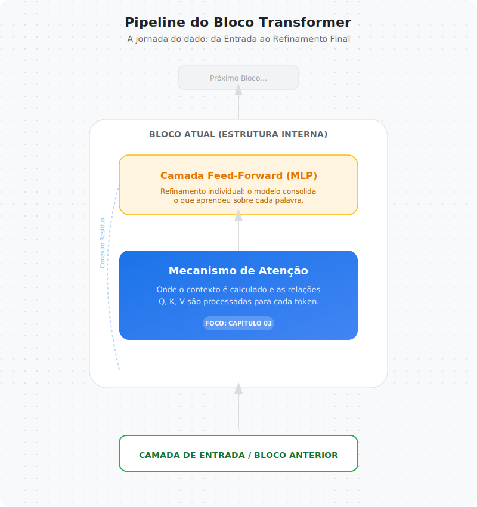

# Capítulo 03 — Atenção (Self-Attention)

Nos capítulos anteriores, aprendemos:

- o que é um LLM
- como texto vira números
- como vetores representam linguagem

Agora chegamos ao ponto onde os LLMs realmente começam a “pensar”.

A pergunta central deste capítulo é:

> Como o modelo decide quais partes do contexto são importantes?

Essa pergunta levou à criação do mecanismo mais revolucionário da história dos modelos de linguagem:

**Self-Attention**

---
---

## Arquivos do Capítulo
- [README.md](README.md)
- [notebook.ipynb](notebook.ipynb)
- [links.md](links.md)
- [infograficos/README.md](infograficos/README.md)

## O problema do contexto

Vamos começar com um exemplo clássico.

Traduza a frase alemã:

> Kannst du mir helfen diesen Satz zu übersetzen?

Se tentarmos traduzir palavra por palavra, obtemos algo incorreto.
A tradução correta depende de entender a frase inteira.

Isso acontece porque linguagem não é linear.
Palavras dependem de outras que podem aparecer:

- antes
- depois
- muito distantes na frase

Modelos antigos tinham dificuldade com isso.

---

## A ideia intuitiva da atenção

Atenção nasce de uma ideia simples:

> Cada palavra deve decidir quanto ela precisa olhar para outras palavras.

Por exemplo, na frase:

> "O gato que estava no telhado miou"

A palavra “miou” precisa entender quem realizou a ação.
Para isso, ela precisa prestar mais atenção em “gato” do que em “telhado”.

Atenção permite que cada token atribua **pesos de importância** aos outros tokens.

---

## Construindo vetores de contexto

Matematicamente, atenção constrói um novo vetor chamado **vetor de contexto**.

Esse vetor é calculado como uma média ponderada dos vetores de entrada.

Cada token recebe:

- pesos de atenção
- combinação ponderada dos vetores de entrada

Esse vetor final representa o token considerando todo o contexto relevante.

---

## Introduzindo Query, Key e Value

Até agora, falamos apenas de pesos.
Mas como esses pesos são calculados?

Aqui entram três projeções fundamentais:

- Query (Q)
- Key (K)
- Value (V)

Cada token gera três representações diferentes:

- Query → o que estou procurando?
- Key → o que eu ofereço?
- Value → qual informação eu carrego?

Os pesos de atenção são calculados comparando:

## Query × Key

Depois, usamos esses pesos para combinar os Values.

---

## Self-Attention com pesos treináveis

Nos Transformers reais, Q, K e V não são cópias dos embeddings.

Eles são criados por matrizes treináveis:

- Wq
- Wk
- Wv

Essas matrizes permitem que o modelo aprenda diferentes formas de representar o contexto.

Isso transforma atenção em um mecanismo adaptável.

---

## Máscara causal: impedindo o modelo de ver o futuro

Modelos autoregressivos como GPT precisam obedecer uma regra fundamental:

> O modelo não pode ver tokens futuros durante o treinamento.

Para garantir isso, usamos uma **máscara causal**.

Essa máscara:

- bloqueia conexões com tokens futuros
- força o modelo a prever o próximo token honestamente
- garante consistência entre treino e geração

---

## Dropout na atenção

Durante o treinamento, também aplicamos **dropout** nos pesos de atenção.

Dropout:

- remove conexões aleatórias temporariamente
- evita overfitting
- melhora generalização

---

## Multi-Head Attention

Até agora, usamos apenas uma forma de atenção.

Mas linguagem é complexa.
Um único mecanismo pode não capturar todas as relações.

Multi-head attention resolve isso permitindo que o modelo:

- observe múltiplos padrões simultaneamente
- capture relações sintáticas e semânticas paralelamente

Cada cabeça aprende um tipo diferente de relacionamento linguístico.

Os resultados das cabeças são combinados em um único vetor de contexto.

---

## Onde a atenção entra no Transformer

Agora podemos posicionar a atenção dentro da arquitetura completa.

Self-attention é o primeiro grande bloco do Transformer.
Ele permite que o modelo:

- compreenda contexto global
- construa representações ricas
- prepare dados para camadas posteriores

---

## Por que atenção mudou tudo

Antes dos Transformers:

- modelos processavam texto sequencialmente
- dependências longas eram difíceis
- treinamento era lento

Com atenção:

- contexto global é acessível
- processamento pode ser paralelo
- modelos escalam melhor

Essa mudança permitiu a criação dos LLMs modernos.

---

## Conectando com o próximo capítulo

Agora sabemos:

- como tokens viram vetores
- como vetores viram contexto
- como atenção decide relevância

No próximo capítulo, vamos juntar essas peças e construir:

> A arquitetura completa de um GPT

---

## 🧾 Glossário Rápido — Capítulo 03

**Self-Attention**  
Mecanismo que permite a um token analisar outros tokens da mesma sequência.

**Query (Q)**  
Representa o que um token busca no contexto.

**Key (K)**  
Representa o que cada token oferece como informação.

**Value (V)**  
Conteúdo real usado para construir o vetor de contexto.

**Máscara Causal**  
Bloqueia acesso a tokens futuros.

**Multi-Head Attention**  
Executa múltiplos mecanismos de atenção em paralelo.

---

### 🚀 Execute agora

- **Notebook:** `03-atencao/notebook.ipynb`
- **Abrir direto no Colab:** 
