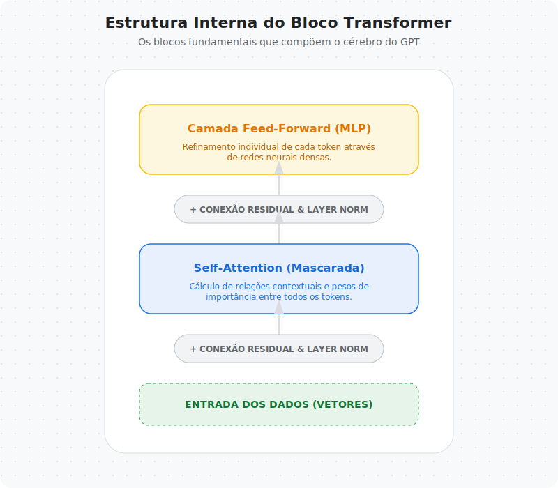
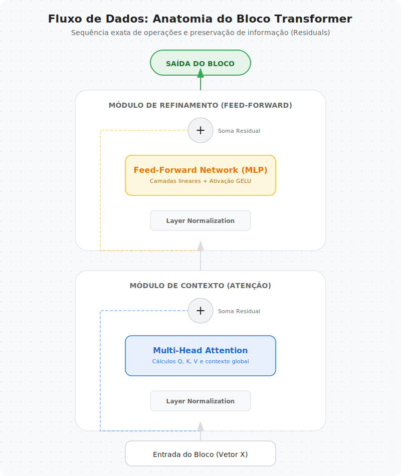
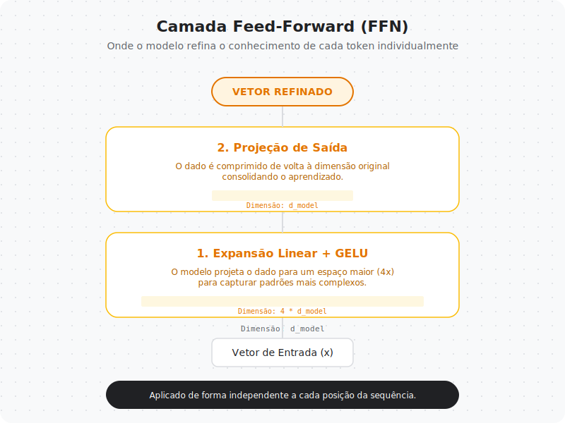
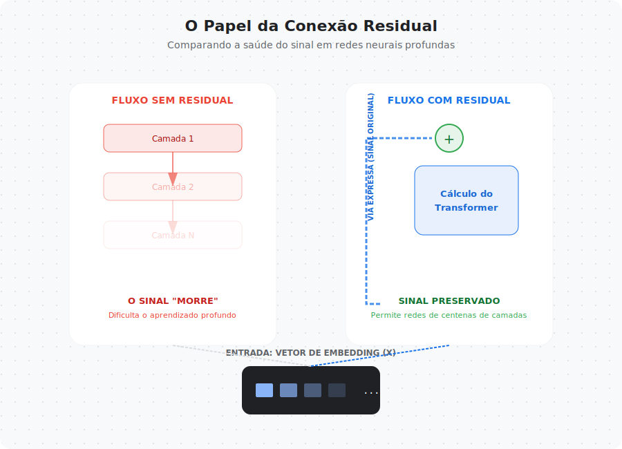
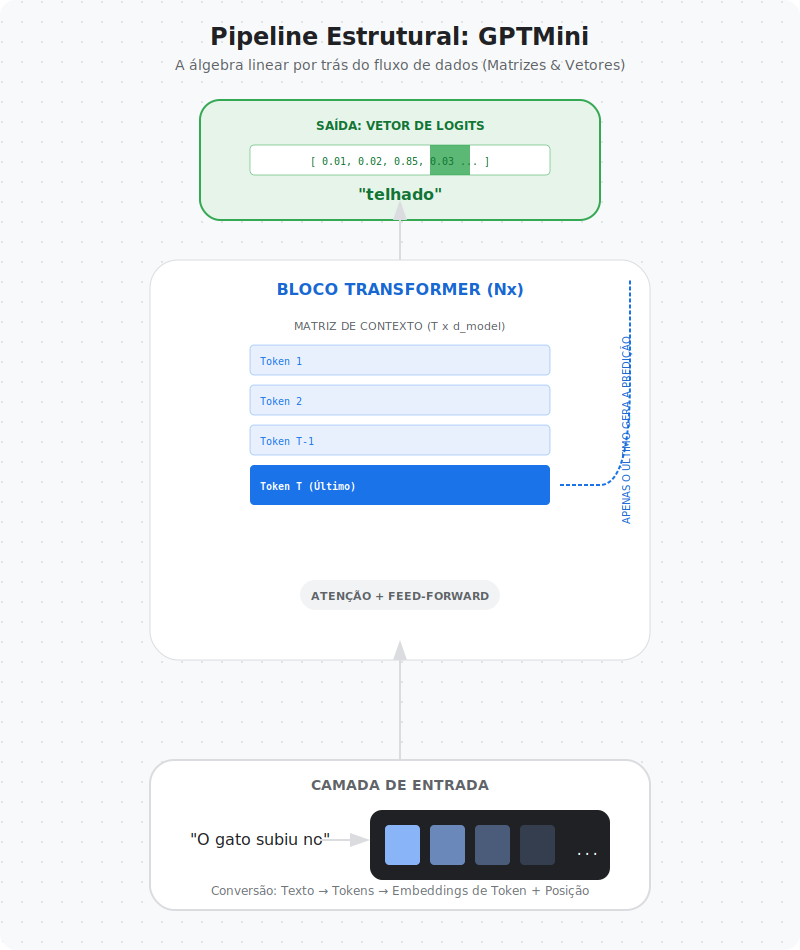

# Capítulo 04 — Construindo um GPT do Zero

Nos capítulos anteriores, construímos o conhecimento necessário para entender os LLMs:

- aprendemos como texto vira números
- entendemos embeddings
- exploramos o mecanismo de self-attention

Agora chegamos ao momento em que tudo isso se conecta.

Neste capítulo, vamos montar um modelo GPT completo, peça por peça, entendendo cada bloco que compõe essa arquitetura.

---

## Relembrando a jornada até aqui

Antes de começar a construção do modelo, vale revisitar o pipeline que já aprendemos.

Um LLM moderno recebe:

1. Texto bruto  
2. Tokenização  
3. Token IDs  
4. Embeddings  
5. Self-attention para construir contexto  

Até o capítulo anterior, exploramos cada etapa isoladamente.

Agora vamos conectar essas partes dentro de uma arquitetura funcional.

---

## O bloco fundamental do Transformer

O GPT é construído empilhando múltiplos blocos Transformer.

Cada bloco contém quatro componentes principais:

- Self-Attention  
- Feedforward Network  
- Conexão residual  
- Normalização  

Esse bloco é repetido diversas vezes ao longo do modelo, permitindo que o contexto seja refinado progressivamente.

---

## Como os dados fluem dentro de um bloco Transformer

Quando um token entra em um bloco Transformer, ele passa por uma sequência de transformações.

O fluxo básico é:

1. Self-attention constrói contexto  
2. Conexão residual preserva informação original  
3. Normalização estabiliza valores  
4. Feedforward refina representações  
5. Nova conexão residual mantém estabilidade  

Esse design permite que Transformers sejam extremamente profundos sem perder informação.

---

## Feedforward Network: refinando representações

Após a etapa de atenção, cada posição da sequência passa por uma rede neural feedforward.

Essa camada:

- é aplicada independentemente a cada token
- introduz não-linearidade
- expande e comprime a dimensionalidade dos vetores
- permite refinamento semântico

Sem feedforward, o modelo seria limitado a combinações lineares dos embeddings.

---

## Conexões residuais e normalização

Treinar redes profundas costuma gerar problemas de estabilidade e perda de gradiente.

Transformers resolvem isso usando duas técnicas fundamentais:

### Conexões residuais

Permitem que a informação original continue fluindo ao longo da rede.

### Layer Normalization

Mantém distribuições numéricas estáveis durante o treinamento.

Juntas, essas duas técnicas tornam possível empilhar dezenas de blocos Transformer.

---

## Construindo um GPT didático

Agora podemos juntar todas as peças.

Um GPT básico contém:

- embeddings de tokens  
- embeddings posicionais  
- múltiplos blocos Transformer  
- camada linear de saída  

Esse pipeline transforma uma sequência de tokens em probabilidades para o próximo token.

---

## O papel da máscara causal

Como vimos no capítulo anterior, modelos autoregressivos precisam prever o próximo token sem olhar o futuro.

Durante o treinamento, aplicamos uma máscara causal para garantir que:

- cada posição só enxergue tokens anteriores
- o modelo aprenda geração sequencial realista

Essa propriedade é o que permite ao GPT gerar texto de forma coerente.

---

## Geração autoregressiva

Depois de treinado, o modelo pode gerar texto token por token.

O processo funciona assim:

1. Recebe tokens iniciais  
2. Prediz probabilidades do próximo token  
3. Seleciona um token  
4. Adiciona à sequência  
5. Repete o processo  

Esse ciclo permite gerar sequências arbitrariamente longas.

---

## Como isso se conecta com modelos reais

Modelos GPT comerciais usam exatamente a mesma arquitetura básica, mas com:

- muito mais parâmetros  
- muito mais dados  
- técnicas avançadas de treinamento  
- paralelização massiva  

O modelo didático que construiremos mantém os mesmos princípios fundamentais.

---

## O que construiremos no notebook

No notebook deste capítulo vamos implementar:

- Self-attention com máscara causal  
- Feedforward network  
- TransformerBlock completo  
- GPTMini empilhando blocos  
- Loop de treinamento simples  
- Geração autoregressiva  

O objetivo não é performance, mas compreensão estrutural.

---

## Limitações do modelo didático

Nosso modelo terá algumas simplificações:

- dataset pequeno  
- poucas camadas  
- dimensionalidade reduzida  
- treinamento curto  

Essas simplificações tornam o modelo viável para execução em CPU e ambiente educacional.

---

## Preparando o próximo passo

Depois de construir o GPT, surge uma nova pergunta:

> Como treinamos modelos dessa escala de forma eficiente?

Esse será o foco do próximo capítulo, onde exploraremos:

- função de perda  
- otimização  
- estratégias de treinamento  
- geração controlada  

---

## 🧾 Glossário Rápido — Capítulo 04

**Transformer Block**  
Unidade básica composta por self-attention, feedforward, residual e normalização.

**Feedforward Network**  
Rede neural aplicada separadamente a cada posição da sequência.

**Layer Normalization**  
Técnica que estabiliza distribuições numéricas durante o treinamento.

**Residual Connection**  
Atalho que permite que entradas sejam somadas às saídas de camadas profundas.

**Autoregressive Generation**  
Processo de gerar tokens sequencialmente com base nos tokens anteriores.

---

> Neste capítulo, saímos do território conceitual e entramos na construção real de modelos generativos.

---

### 🚀 Execute agora

- **Notebook:** `04-gpt-do-zero/notebook.ipynb`
- **Abrir direto no Colab:** (veja `links.md`)
