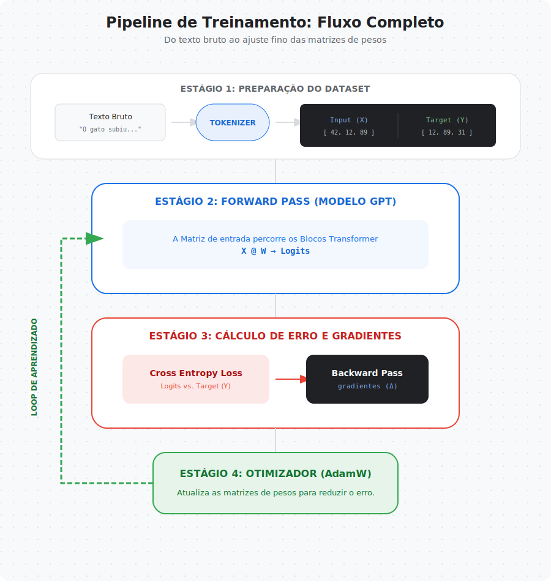
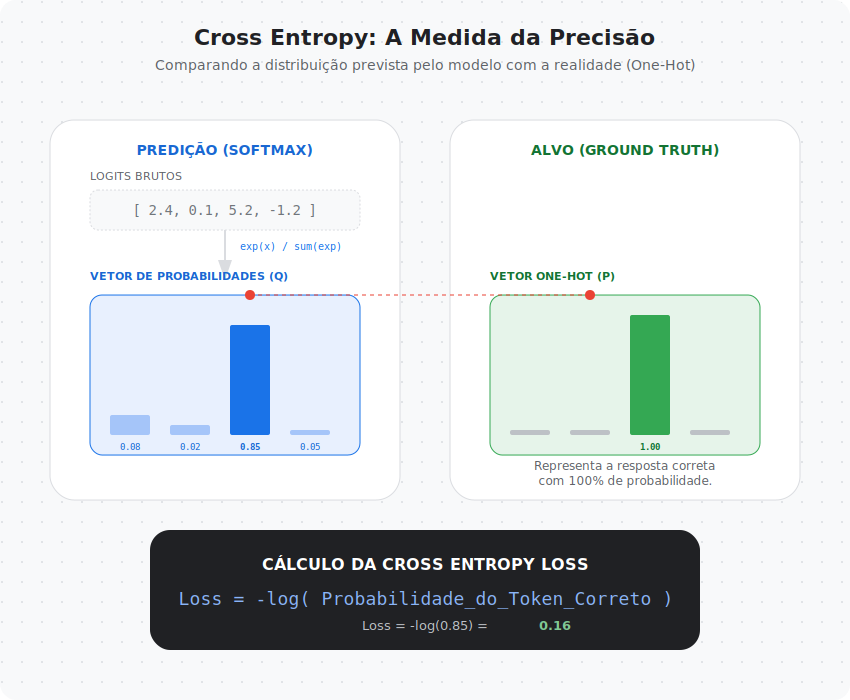
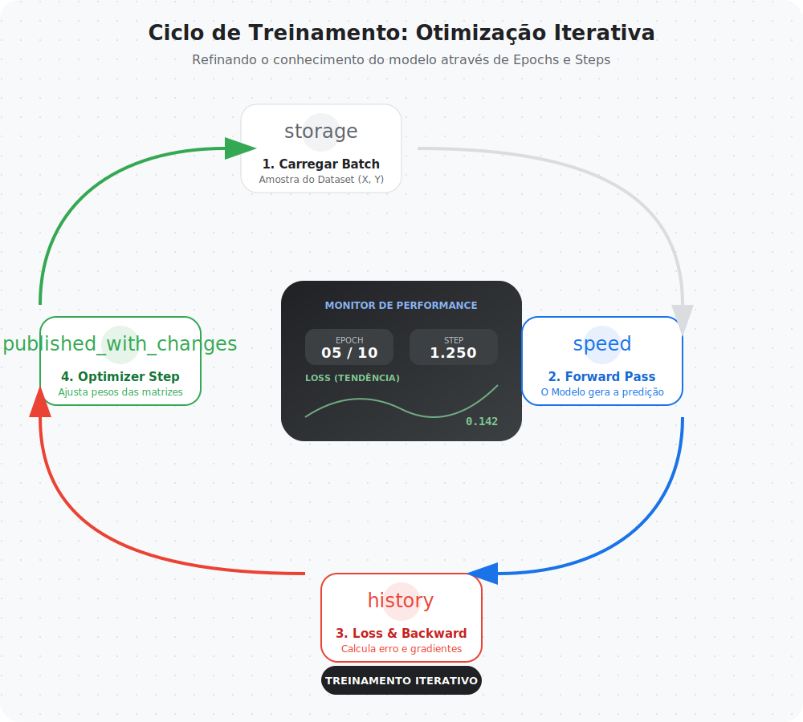
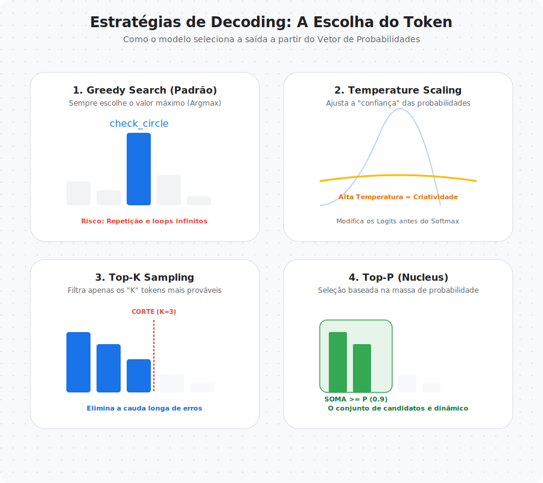
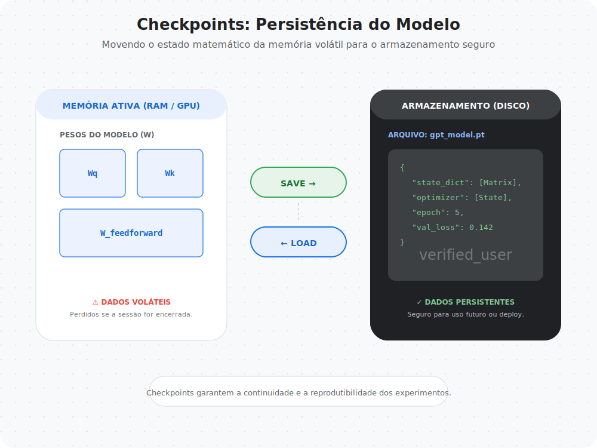

# Capítulo 05 — Pré-Treinamento e Geração de Texto

Nos capítulos anteriores, construímos o corpo de um modelo GPT.

- aprendemos como texto vira números  
- aprendemos como embeddings representam linguagem  
- aprendemos como self-attention constrói contexto  
- montamos um GPT funcional  

Agora surge a pergunta mais importante:

> Como o modelo aprende linguagem?

Este capítulo responde exatamente isso.

---

## O que significa treinar um modelo de linguagem

Um modelo GPT não aprende gramática explicitamente.

Ele aprende padrões estatísticos observando sequências de texto.

A tarefa fundamental de treinamento é:

> prever o próximo token com base nos tokens anteriores

Pode parecer simples, mas essa tarefa contém toda a complexidade da linguagem.

---

## O pipeline de treinamento de um LLM

Treinar um modelo envolve várias etapas que se repetem milhares ou milhões de vezes.

O fluxo geral é:

1. Dataset de texto  
2. Tokenização  
3. Forward pass no modelo  
4. Cálculo da loss  
5. Backpropagation  
6. Atualização dos pesos  

Esse ciclo é conhecido como loop de treinamento.

---

## Como avaliamos se o modelo está aprendendo

Quando o modelo prevê o próximo token, ele não escolhe uma palavra diretamente.

Ele produz uma distribuição de probabilidades para todas as palavras do vocabulário.

A qualidade do modelo depende de quão próximas essas probabilidades estão do token correto.

---

## Cross Entropy: medindo o erro probabilístico

Para medir o erro do modelo usamos uma função chamada **cross entropy**.

A cross entropy mede:

- quão diferente a distribuição prevista está da distribuição real
- quanto o modelo ficou "surpreso" com o token correto

Quanto menor a cross entropy, melhor o modelo.

---

## Perplexidade: interpretando a qualidade do modelo

Outra métrica importante é a perplexidade.

Ela representa o grau de incerteza do modelo ao prever o próximo token.

Uma perplexidade alta indica:

- modelo confuso
- muitas possibilidades plausíveis

Uma perplexidade baixa indica:

- modelo confiante
- previsões mais precisas

---

## O loop de treinamento completo

O aprendizado do modelo ocorre dentro de um ciclo repetitivo.

O ciclo consiste em:

### Forward Pass
O modelo recebe tokens e produz previsões.

### Cálculo da Loss
A previsão é comparada com o token real.

### Backpropagation
O erro é propagado pela rede para calcular gradientes.

### Atualização de Pesos
Os pesos são ajustados para reduzir o erro.

Esse processo é repetido em batches e epochs.

---

## Treinamento em batches

Treinar usando todo o dataset de uma vez seria computacionalmente inviável.

Por isso, dividimos os dados em pequenos grupos chamados batches.

Isso permite:

- melhor eficiência computacional
- estabilidade do treinamento
- paralelização

---

## Monitorando o aprendizado do modelo

Durante o treinamento, monitoramos:

- training loss
- validation loss

Se a loss de validação começa a aumentar enquanto a loss de treinamento diminui, pode indicar overfitting.

---

## Depois do treinamento: geração de texto

Depois que o modelo aprende padrões da linguagem, ele pode gerar texto.

Mas geração não é determinística.

O modelo produz probabilidades e precisamos decidir como escolher o próximo token.

---

## Estratégias de geração de texto

Existem várias formas de gerar texto a partir das probabilidades.

### Greedy Decoding
Sempre escolhe o token mais provável.

- Texto previsível
- Pouca criatividade

### Temperature Sampling
Controla aleatoriedade das probabilidades.

- Temperatura baixa → mais previsível  
- Temperatura alta → mais criativo  

### Top-k Sampling
Escolhe entre os k tokens mais prováveis.

- Controla diversidade
- Evita escolhas improváveis

### Nucleus Sampling (Top-p)
Escolhe tokens que compõem uma probabilidade acumulada.

- Estratégia usada em muitos LLMs modernos
- Equilibra coerência e diversidade

---

## Salvando modelos: checkpoints

Treinar modelos grandes pode levar horas, dias ou semanas.

Por isso salvamos estados intermediários do modelo chamados checkpoints.

Checkpoints permitem:

- retomar treinamento
- evitar perda de progresso
- compartilhar modelos
- reproduzir experimentos

---

## Pesos pré-treinados e modelos fundacionais

Modelos modernos raramente são treinados do zero para cada tarefa.

Eles são:

1. Pré-treinados em grandes datasets  
2. Adaptados para tarefas específicas  

Esse conceito é conhecido como foundation models.

---

## Limitações do treinamento didático

Neste projeto usamos:

- datasets pequenos  
- modelos compactos  
- treinamento curto  

Essas simplificações permitem execução no Colab, mas mantêm os princípios fundamentais do treinamento de LLMs.

---

## O que construiremos no notebook

Neste capítulo vamos implementar:

- cálculo da cross entropy loss
- loop de treinamento completo
- monitoramento do treinamento
- diferentes estratégias de geração
- salvamento e carregamento de modelos
- comparação entre modelos antes e depois do treinamento

---

## Preparando os próximos capítulos

Depois de aprender como treinar um modelo, surge o próximo passo natural:

> Como adaptar um modelo para tarefas específicas?

Nos próximos capítulos exploraremos:

- fine-tuning  
- instruction tuning  
- alinhamento de modelos  

---

## 🧾 Glossário Rápido — Capítulo 05

**Cross Entropy**  
Métrica que mede diferença entre distribuições de probabilidade.

**Perplexidade**  
Medida de incerteza do modelo ao prever tokens.

**Forward Pass**  
Etapa onde o modelo produz previsões.

**Backpropagation**  
Processo de ajuste dos pesos com base no erro.

**Batch**  
Grupo de exemplos usados em uma etapa do treinamento.

**Epoch**  
Uma passagem completa pelo dataset.

**Sampling**  
Processo de escolha do próximo token com base em probabilidades.

**Checkpoint**  
Salvamento do estado do modelo durante o treinamento.

---

> Nos capítulos anteriores construímos o cérebro do modelo.  
> Neste capítulo começamos a ensinar o modelo a pensar.

---

### 🚀 Execute agora

- **Notebook:** `05-pre-treinamento/notebook.ipynb`
- **Abrir direto no Colab:** 
