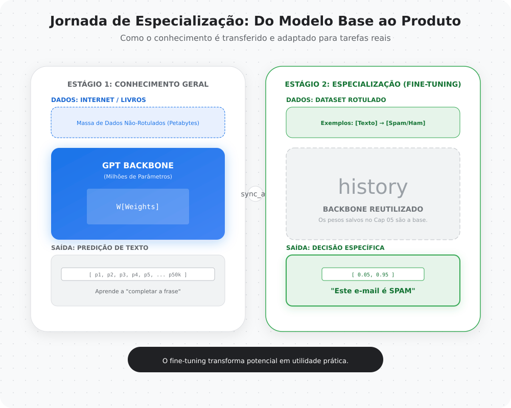
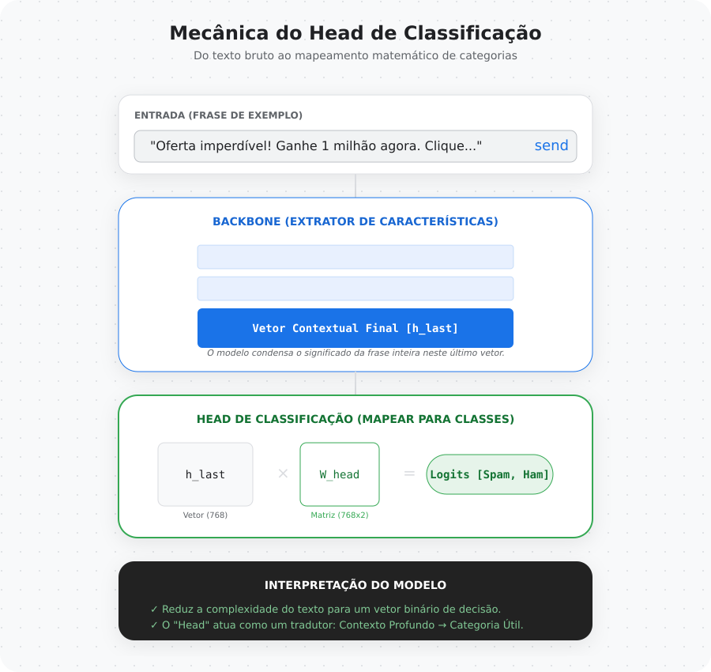
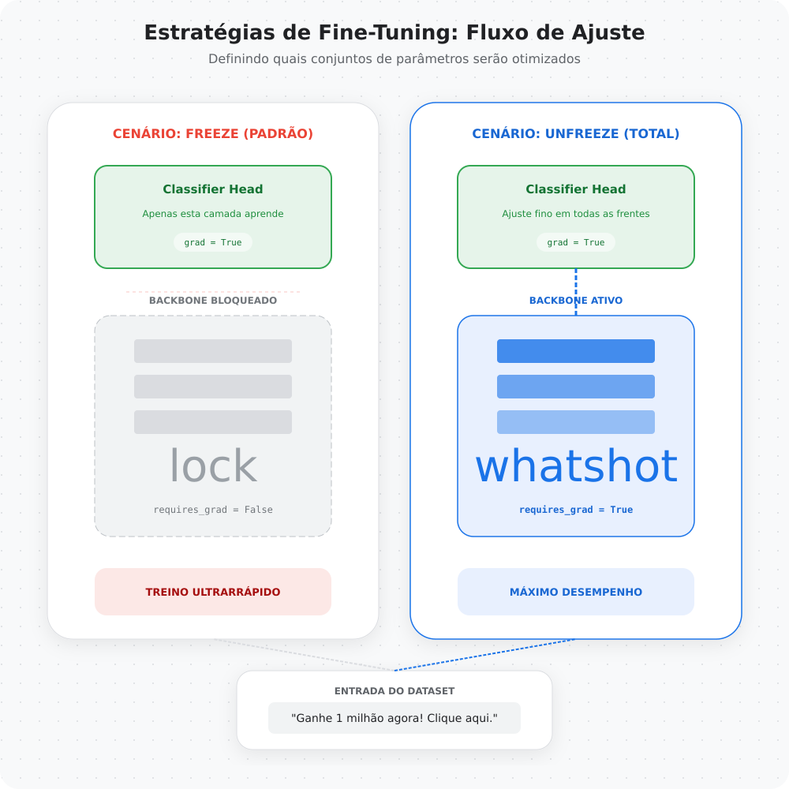
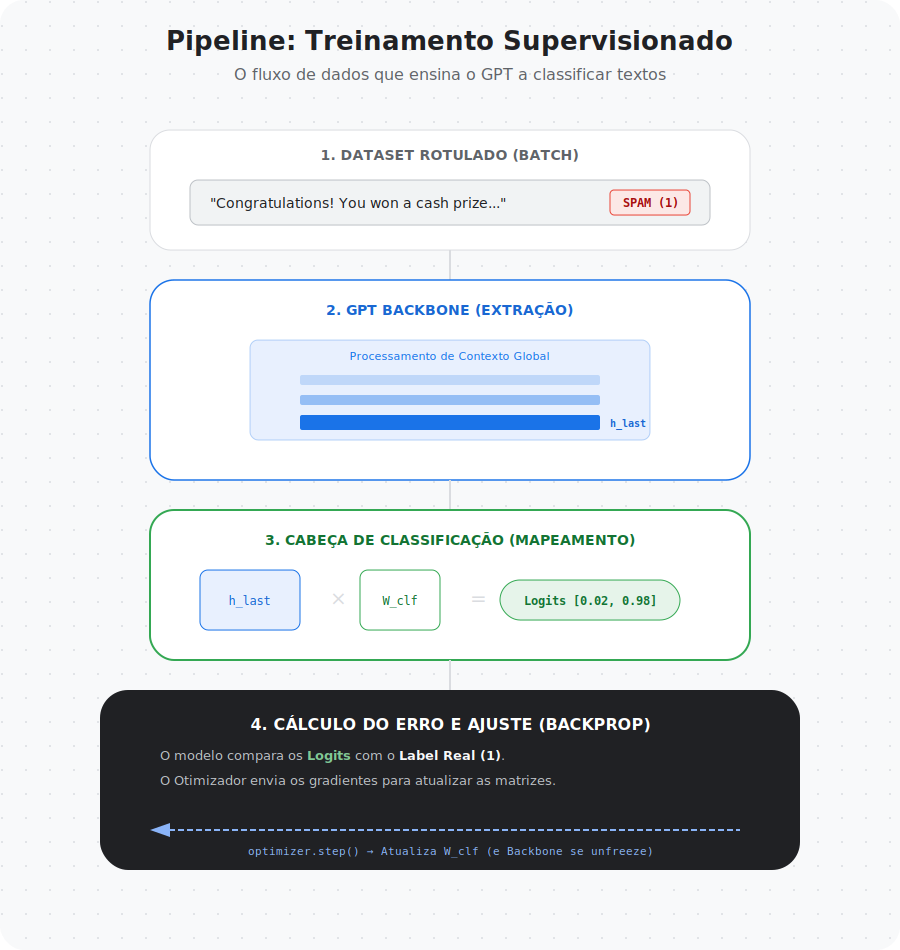
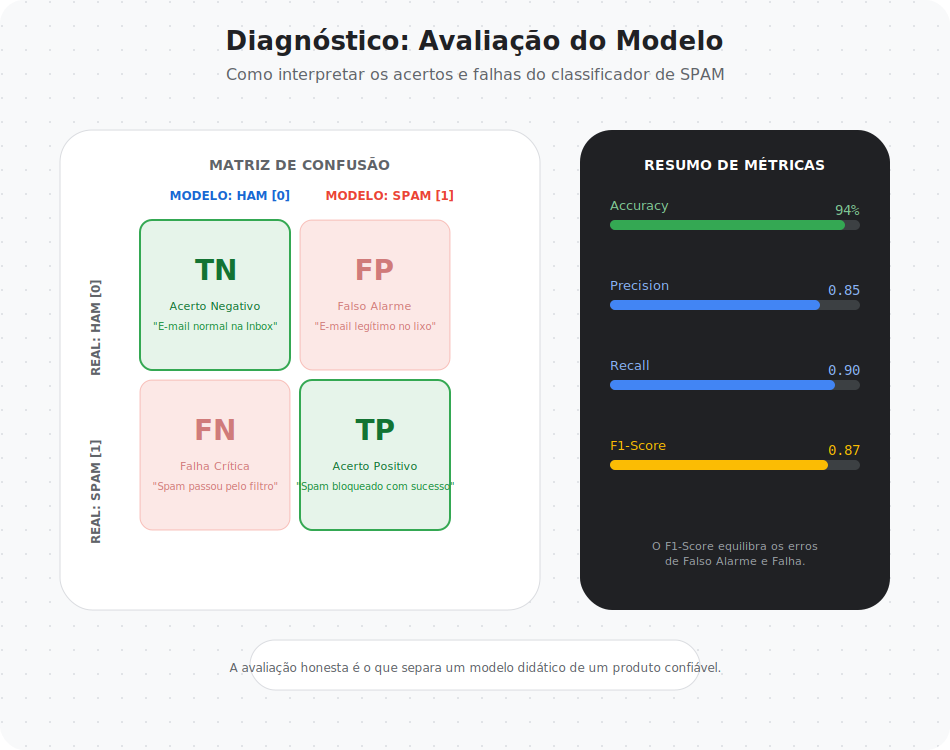

# Capítulo 06 — Fine-Tuning para Classificação

Nos capítulos anteriores, aprendemos como construir e treinar um modelo GPT capaz de aprender padrões da linguagem.

- transformamos texto em números  
- construímos mecanismos de atenção  
- montamos um modelo GPT completo  
- ensinamos o modelo a aprender linguagem  

Agora surge uma nova pergunta:

> Como usamos esse conhecimento para resolver problemas reais?

Este capítulo responde exatamente isso.

---
---

## Arquivos do Capítulo
- [README.md](README.md)
- [notebook.ipynb](notebook.ipynb)
- [links.md](links.md)
- [infograficos/README.md](infograficos/README.md)

## O que é Fine-Tuning

Um modelo de linguagem aprende padrões gerais da linguagem durante o pré-treinamento.

Ele aprende:

- gramática
- semântica
- relações entre palavras
- estrutura de frases

Mas ele não nasce sabendo executar tarefas específicas.

Fine-tuning é o processo de adaptar um modelo pré-treinado para resolver uma tarefa supervisionada.

---

## Pré-Treinamento vs Especialização

Podemos imaginar o treinamento de um LLM como o aprendizado humano.

O pré-treinamento é equivalente à educação básica e geral.

Fine-tuning é equivalente à especialização profissional.

Durante o pré-treinamento o modelo aprende linguagem em geral.  
Durante o fine-tuning o modelo aprende a executar tarefas específicas.

---

## Transformando um modelo generativo em classificador

Modelos GPT são projetados para prever o próximo token.

Para transformar o modelo em classificador precisamos modificar o objetivo do treinamento.

Em vez de prever a próxima palavra, o modelo passa a prever uma classe associada ao texto.

---

## Extraindo representações do modelo

Quando um texto passa pelo GPT, cada token gera uma representação contextual.

Essas representações contêm o entendimento do modelo sobre o texto.

Para classificação precisamos transformar essas representações em uma decisão final.

---

## Classification Head

A solução mais comum é adicionar uma camada de classificação no topo do modelo.

Essa camada recebe a representação do texto e produz logits para cada classe.

Esse processo reutiliza o conhecimento linguístico já aprendido pelo modelo.

---

## Como escolher a representação do texto

Existem diferentes estratégias para extrair uma representação global:

- usar o embedding do último token
- usar média dos embeddings da sequência
- usar tokens especiais

Neste capítulo utilizaremos uma abordagem simples e didática baseada na última posição da sequência.

---

## Estratégias de Fine-Tuning

Nem sempre precisamos treinar todo o modelo novamente.

Existem diferentes estratégias:

### Fine-Tuning Completo

Todos os pesos do modelo são atualizados.

Vantagens:
- maior capacidade de adaptação

Desvantagens:
- maior custo computacional
- maior risco de overfitting

---

### Congelamento de Camadas

Podemos congelar parte do modelo e treinar apenas algumas camadas.

Estratégias comuns incluem:

- treinar apenas a camada de classificação
- treinar apenas as últimas camadas
- liberar gradualmente o treinamento do modelo

Essa abordagem reduz custo computacional e melhora estabilidade.

---

## Treinamento Supervisionado

Fine-tuning utiliza datasets rotulados.

Cada exemplo contém:

- texto de entrada
- rótulo associado

O treinamento passa a minimizar o erro entre a classe prevista e a classe real.

---

## Pipeline de treinamento para classificação

O fluxo geral do fine-tuning é semelhante ao treinamento do modelo de linguagem, mas com objetivo diferente.

O pipeline inclui:

1. Texto rotulado  
2. Tokenização  
3. Processamento pelo GPT  
4. Extração de representação do texto  
5. Camada de classificação  
6. Cálculo da loss supervisionada  
7. Atualização dos pesos  

---

## Avaliando classificadores de texto

Modelos de classificação não devem ser avaliados apenas por accuracy.

Existem métricas importantes para compreender comportamento do modelo.

---

### Accuracy

Mede a proporção de previsões corretas.

---

### Precision

Mede quantas previsões positivas estavam corretas.

---

### Recall

Mede quantos exemplos positivos foram corretamente detectados.

---

### F1-score

Equilibra precision e recall.

---

### Confusion Matrix

Mostra como o modelo erra e acerta cada classe.

Essa métrica é fundamental para interpretar modelos em aplicações reais.

---

## Inferência e uso prático do modelo

Depois do treinamento, o modelo pode ser utilizado para classificar novos textos.

Esse processo envolve:

- tokenizar o texto
- executar o modelo
- interpretar probabilidades de classes
- selecionar a classe mais provável

---

## Limitações do Fine-Tuning Didático

Neste projeto utilizamos:

- datasets pequenos
- modelos compactos
- treinamento simplificado

Essas simplificações permitem execução no Colab e facilitam aprendizado conceitual.

---

## O que construiremos no notebook

Neste capítulo vamos implementar:

- um GPT adaptado para classificação
- reutilização de pesos pré-treinados
- treinamento supervisionado
- comparação entre estratégias de fine-tuning
- avaliação com métricas de classificação
- inferência com novos textos

---

## Preparando os próximos capítulos

Depois de aprender fine-tuning supervisionado, surge o próximo passo natural:

> Como ensinar modelos a seguir instruções humanas?

Nos próximos capítulos exploraremos:

- instruction tuning
- alinhamento de modelos
- RLHF
- técnicas modernas de adaptação de LLMs

---

## 🧾 Glossário Rápido — Capítulo 06

**Fine-Tuning**  
Processo de adaptar um modelo pré-treinado para uma tarefa específica.

**Classification Head**  
Camada adicional usada para prever classes a partir das representações do modelo.

**Freeze**  
Congelar pesos do modelo para evitar atualização durante treinamento.

**Unfreeze**  
Permitir atualização dos pesos durante fine-tuning.

**Supervised Dataset**  
Dataset contendo textos e rótulos associados.

**Confusion Matrix**  
Tabela que mostra acertos e erros de classificação.

---

> Nos capítulos anteriores ensinamos o modelo a entender linguagem.  
> Neste capítulo ensinamos o modelo a tomar decisões.

---

### 🚀 Execute agora

- **Notebook:** `06-fine-tuning/notebook.ipynb`
- **Abrir direto no Colab:** 
