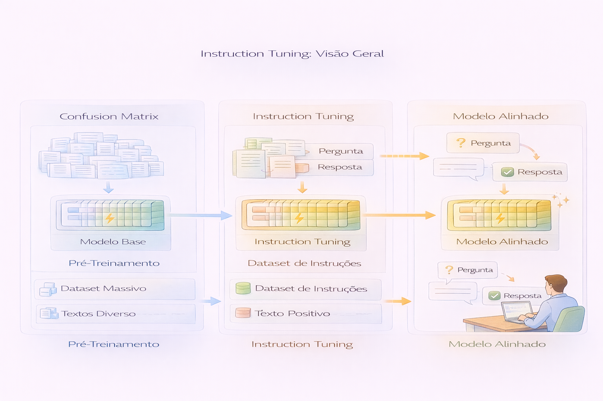
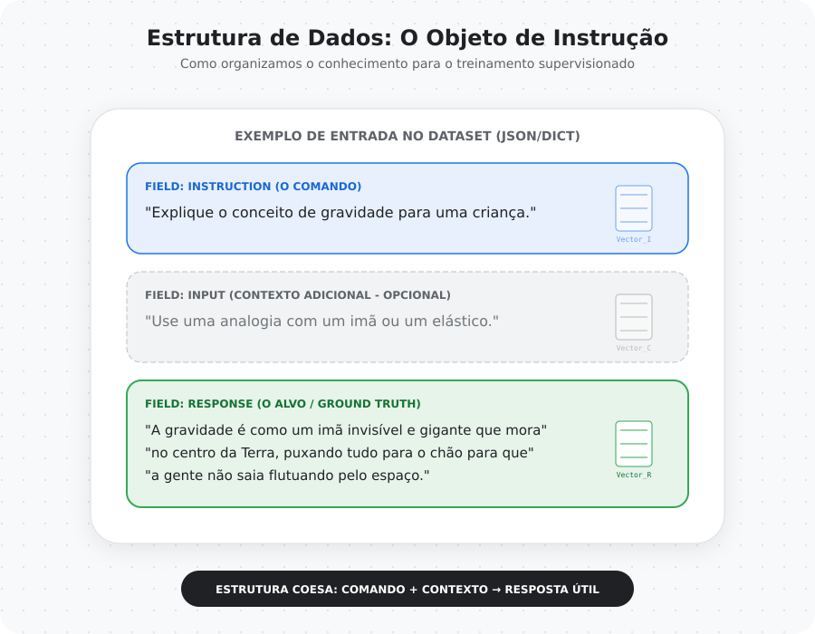
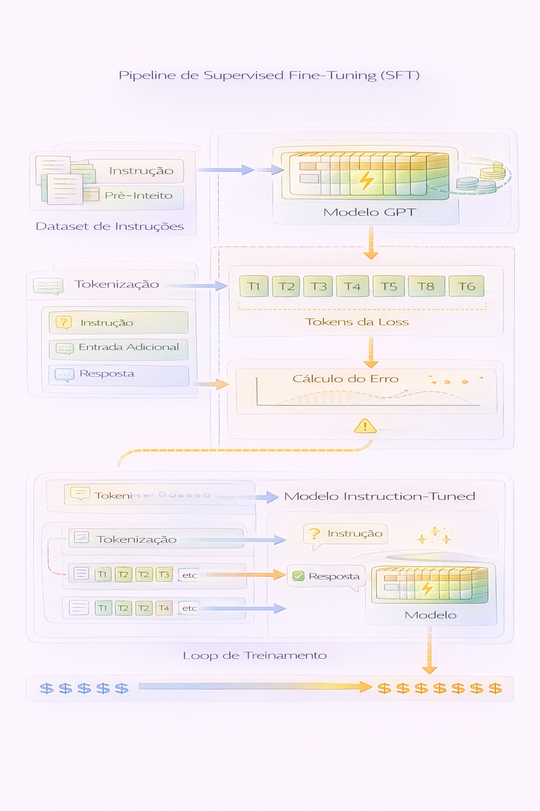

# Capítulo 07 — Instruction Tuning

Nos capítulos anteriores, construímos progressivamente um modelo de linguagem completo.

Nós ensinamos o modelo a:

- transformar texto em números  
- construir representações semânticas  
- aprender relações contextuais com atenção  
- gerar linguagem coerente  
- adaptar comportamento para tarefas supervisionadas  

Agora surge a pergunta final desta jornada:

> Como ensinar o modelo a responder instruções humanas?

Este capítulo responde essa pergunta.

---

## Do Modelo Base ao Assistente Conversacional

Durante o pré-treinamento, um modelo aprende padrões da linguagem observando grandes volumes de texto.

Ele aprende:

- como frases são construídas  
- como ideias são conectadas  
- como palavras costumam aparecer juntas  

Mas esse aprendizado é passivo.

O modelo aprende **como a linguagem continua**, não **como responder perguntas ou executar tarefas**.

---

## O Surgimento do Instruction Tuning

Instruction tuning é o processo de ensinar o modelo a responder instruções humanas.

Ele transforma o modelo de:

👉 um gerador de texto  
👉 em um assistente capaz de interagir com pessoas  

---

## Uma Analogia Humana

Podemos comparar o treinamento de LLMs com a formação de um profissional.

Pré-treinamento é equivalente à educação geral.

Fine-tuning supervisionado é equivalente a uma especialização técnica.

Instruction tuning é equivalente a aprender a trabalhar com clientes e interpretar pedidos humanos.

---

## Como Modelos Aprendem a Seguir Instruções

Modelos não entendem linguagem da forma como humanos entendem.

Eles aprendem observando exemplos.

Se queremos que o modelo responda instruções, precisamos fornecer exemplos de:

- instruções humanas  
- contexto adicional (quando necessário)  
- respostas desejadas  

---

## Estrutura de Dados para Instruction Tuning

Datasets de instruction tuning geralmente seguem um formato estruturado.

Eles podem conter três componentes:

1. Instruction  
2. Input (opcional)  
3. Response  

Esse formato permite que o modelo aprenda padrões de interação.

---

## A Importância do Prompt Estruturado

Durante o treinamento, o modelo não recebe apenas perguntas.

Ele recebe prompts estruturados que indicam claramente:

- qual é a tarefa  
- qual é o contexto  
- qual resposta é esperada  

Essa estrutura ensina o modelo a interpretar intenções humanas.

---

## Mascaramento da Loss

Instruction tuning utiliza uma estratégia fundamental:

O modelo aprende apenas com a resposta.

Durante o treinamento:

- tokens da instrução são usados como contexto  
- tokens da resposta são usados para cálculo da loss  

Isso impede que o modelo aprenda a reproduzir o prompt e o incentiva a aprender a responder.

---

## Pipeline de Supervised Fine-Tuning (SFT)

Instruction tuning é implementado como uma forma especializada de fine-tuning supervisionado.

O pipeline envolve:

1. Dataset de instruções  
2. Tokenização estruturada  
3. Reutilização de pesos pré-treinados  
4. Treinamento supervisionado  
5. Avaliação das respostas  

---

## Avaliando Modelos Conversacionais

Modelos conversacionais são difíceis de avaliar com métricas tradicionais.

Accuracy e F1-score não capturam:

- coerência semântica  
- utilidade da resposta  
- naturalidade do texto  
- aderência à instrução  

Por isso, avaliação qualitativa se torna essencial.

---

## O Papel da Qualidade do Dataset

Instruction tuning depende fortemente da qualidade dos exemplos fornecidos.

Datasets com respostas claras e bem estruturadas produzem modelos mais confiáveis.

Datasets inconsistentes podem gerar comportamento imprevisível.

---

## Limitações do Instruction Tuning Didático

Neste projeto utilizamos:

- datasets pequenos  
- modelos compactos  
- treinamento simplificado  

Essas simplificações permitem execução no Colab e facilitam aprendizado conceitual.

Sistemas reais utilizam:

- milhões de exemplos  
- múltiplas etapas de alinhamento  
- avaliação humana contínua  

---

## O Que Construiremos no Notebook

Neste capítulo vamos implementar:

- dataset educacional de instruções  
- formatação de prompts estruturados  
- mascaramento da loss  
- treinamento supervisionado orientado a respostas  
- comparação entre modelo base e modelo instruction-tuned  
- avaliação qualitativa de respostas  

---

## Conectando Toda a Jornada da Série

Ao longo desta série você aprendeu como:

- linguagem é representada numericamente  
- atenção permite compreensão contextual  
- modelos GPT são construídos  
- modelos aprendem linguagem  
- modelos são adaptados para tarefas específicas  
- modelos aprendem a seguir instruções humanas  

Este é o fluxo fundamental que sustenta os assistentes baseados em LLMs modernos.

---

## Para Onde a Jornada Continua

Instruction tuning é apenas uma etapa do alinhamento de modelos.

Sistemas modernos também utilizam:

- reinforcement learning com feedback humano (RLHF)  
- avaliação automatizada de qualidade  
- ajuste contínuo com dados reais  

Esses temas representam a fronteira atual da pesquisa em LLMs.

---

## 🧾 Glossário Rápido — Capítulo 07

**Instruction Tuning**  
Processo de treinar modelos para seguir instruções humanas.

**Supervised Fine-Tuning (SFT)**  
Treinamento supervisionado usando pares instrução-resposta.

**Prompt Estruturado**  
Formato padronizado usado para orientar o modelo.

**Masking da Loss**  
Técnica que calcula erro apenas sobre tokens da resposta.

**Alignment**  
Processo de adaptar comportamento do modelo para expectativas humanas.

---

> No início da série, ensinamos o modelo a reconhecer padrões da linguagem.  
> No final da série, ensinamos o modelo a conversar.
