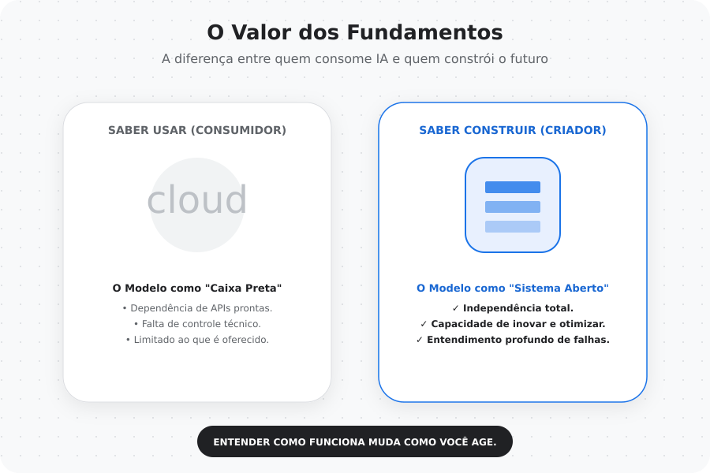

# Capítulo 08 — Extras, Reflexões e Continuidade

Chegar até aqui representa muito mais do que completar uma sequência de notebooks ou entender conceitos técnicos.

Este capítulo não é sobre construir um novo modelo.
É sobre refletir sobre o que significa entender como esses modelos funcionam.

---
---

## Arquivos do Capítulo
- [README.md](README.md)
- [notebook.ipynb](notebook.ipynb)
- [links.md](links.md)
- [carta-ao-autor.md](carta-ao-autor.md)

## A Jornada Começa com Curiosidade

Quando comecei esta série, a motivação era simples:

> Entender o que realmente acontece dentro de um Large Language Model.

Hoje, ferramentas baseadas em LLMs estão presentes em praticamente todas as áreas da tecnologia.
Elas escrevem textos, geram código, analisam dados e auxiliam na tomada de decisão.

Mas existe uma diferença enorme entre:

- usar uma ferramenta  
- entender como ela funciona  

Esta série nasceu da busca por essa segunda opção.

---

## A Importância dos Fundamentos

Durante muito tempo, inteligência artificial foi apresentada como uma caixa preta.

Modelos recebiam dados e produziam resultados, mas o caminho entre esses dois pontos parecia inacessível.

Estudar os fundamentos muda completamente essa percepção.

Ao entender como:

- texto vira representação numérica  
- embeddings capturam significado  
- atenção constrói contexto  
- transformers processam linguagem  
- treinamento molda comportamento  

o modelo deixa de ser uma caixa preta e passa a ser um sistema compreensível.

---

## O Impacto de Aprender Construindo

Construir cada componente manualmente foi um dos aspectos mais transformadores desta jornada.

Implementar:

- tokenização  
- embeddings  
- self-attention  
- arquitetura GPT  
- treinamento supervisionado  
- instruction tuning  

mostrou que modelos complexos são, na verdade, construídos a partir de conceitos progressivos e conectados.

---

## O Papel do Livro que Inspirou Esta Série

Esta série foi profundamente inspirada pelo livro:

**Build a Large Language Model (From Scratch)**  
Sebastian Raschka

O livro oferece algo raro:

Uma ponte clara entre teoria e prática.

Ele transforma um tema denso em uma jornada estruturada e acessível.

Este projeto não existe como uma correção ou reinterpretação do livro.

Ele existe como:

- um diário de aprendizado  
- uma adaptação pedagógica  
- uma forma de registrar o impacto educacional da obra  

---

## Traduzir Conhecimento Vai Além do Idioma

Produzir esta série em português brasileiro revelou algo importante:

Traduzir conhecimento técnico não é apenas converter palavras.

É adaptar contexto.
É ajustar exemplos.
É pensar na forma como diferentes comunidades aprendem.

A democratização do acesso à inteligência artificial depende diretamente da existência de materiais acessíveis em múltiplos idiomas.

---

## O Papel do Google Colab na Democratização da IA

Executar toda a série no Google Colab não foi apenas uma decisão técnica.

Foi uma decisão educacional.

Permitir que qualquer pessoa execute experimentos sem necessidade de hardware especializado reduz barreiras e amplia o acesso ao aprendizado.

---

## O Valor da Visualização Conceitual

Criar infográficos ao longo da série mostrou como conceitos abstratos podem se tornar muito mais claros quando representados visualmente.

Muitos temas de LLMs envolvem:

- representações vetoriais  
- fluxos de dados  
- interações entre componentes  

Visualizar esses processos facilita o aprendizado e torna o conteúdo mais acessível.

---

## O Que Aprendi Sobre LLMs

Uma das maiores lições desta jornada foi perceber que LLMs não são sistemas mágicos.

Eles são sistemas estatísticos extremamente sofisticados que aprendem padrões da linguagem humana.

Eles não possuem entendimento humano.
Eles possuem modelagem probabilística avançada.

Mesmo assim, o comportamento emergente desses sistemas é capaz de produzir resultados surpreendentes.

---

## Limitações dos Modelos Didáticos

Os modelos construídos nesta série são pequenos e educacionais.

Eles não possuem:

- bilhões de parâmetros  
- datasets massivos  
- infraestrutura distribuída  

Mas eles possuem algo igualmente importante:

Eles mostram claramente como os princípios fundamentais funcionam.

---

## O Que Fica Fora do Escopo, Mas Abre Novos Caminhos

Após entender os fundamentos, surgem naturalmente novos temas:

- RLHF (Reinforcement Learning with Human Feedback)  
- RAG (Retrieval-Augmented Generation)  
- Alignment de modelos  
- Avaliação automatizada de respostas  
- Sistemas multi-agente  
- LLMOps e deployment em produção  

Esses temas representam a continuidade natural do estudo.

---

## Aprender Inteligência Artificial Hoje

Aprender IA atualmente pode parecer intimidador.

A área evolui rapidamente e novos modelos surgem constantemente.

Mas estudar fundamentos oferece algo que não envelhece:

Compreensão estrutural.

Ferramentas mudam.
Arquiteturas evoluem.
Frameworks surgem e desaparecem.

Fundamentos permanecem relevantes.

---

## A Diferença Entre Usar e Entender

Esta série reforçou uma convicção pessoal:

> Saber usar ferramentas é valioso.  
> Saber como elas funcionam é transformador.

Entender fundamentos permite:

- questionar resultados  
- projetar soluções  
- inovar  
- ensinar outras pessoas  

---

## O Papel do Compartilhamento de Conhecimento

Registrar esta jornada mostrou como aprendizado técnico também é uma experiência coletiva.

Produzir material educacional, compartilhar notebooks e documentar descobertas cria oportunidades para que outras pessoas iniciem suas próprias jornadas.

---

## Uma Reflexão Final Sobre Tecnologia

Tecnologia não é apenas código.

Tecnologia é linguagem.
Tecnologia é cultura.
Tecnologia é educação.

LLMs representam uma das maiores transformações recentes na forma como humanos interagem com informação.

Entender esses sistemas é também entender como conhecimento é criado, transmitido e transformado.

---

## Encerrando Esta Jornada

Ao longo desta série, percorremos um caminho completo:

Texto  
→ Tokens  
→ Embeddings  
→ Atenção  
→ Transformers  
→ GPT  
→ Treinamento  
→ Fine-Tuning  
→ Instruction Tuning  

Este capítulo representa o encerramento dessa jornada técnica.

Mas não representa o fim do aprendizado.

---

## O Que Vem Depois

O conhecimento construído aqui abre espaço para:

- explorar sistemas de produção com LLMs  
- desenvolver aplicações baseadas em IA  
- pesquisar novas arquiteturas  
- contribuir com educação técnica  
- participar da evolução da área  

---

> Entender como algo funciona é o primeiro passo para criar algo novo.

---

### 🚀 Explore agora

- **Notebook de Experimentos:** `08-extras/notebook.ipynb`
- **Abrir direto no Colab:** 
